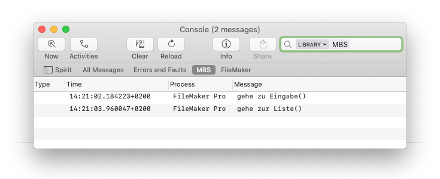

Simple logging to macOS Console.app, to file or to a table.

Requires the MBS plugin. Logging to Console is Mac-only. Contains a copy of our Swiss Army Knife Custom Function for paths conversion and formatting. 

## Getting Started

Please download the example and copy the custom functions to your app. From the Scripts menu turn on logging either to Console.app or to a textfile on your desktop. Everytime you navigate to list and detail view, the action is logged. 

For the documentation of the functions' parameters, take a look their source.

### Using Console.app

We recommend creating a filter to display only MBS messages. Enter 'MBS' into the search field, hit return and change the 'any' selector to 'library', then hit the save button. You can also create a filter for all FileMaker messages using process=FileMaker Pro.

## Contributing

There are many ways to contribute and all community interaction is absolutely welcome:

- Open an issue for any kind of bug you think you have found.
- Open an issue for anything that was confusing to you. Bad, missing or confusing documentation is considered a bug.
- Open a Pull Request for a new or better example. It is a good idea to get in contact first to make sure that it fits the roadmap.
- Write documentation.
- Write a blog post.
- Get in contact and say how you use it or what would be a cool addition.
- Tell the world.

## Thank You!

If you find this useful and want to support further development, please consider sponsoring a small amount – anything is appreciated!
